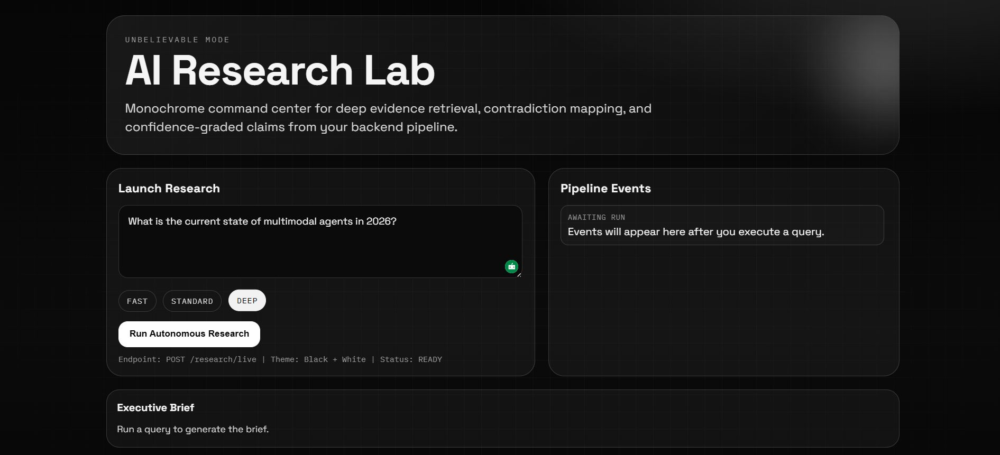
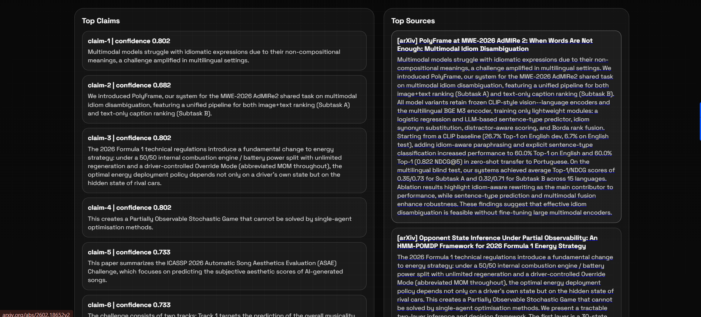

# WikiXiv

WikiXiv is a research assistant platform that takes a question, gathers evidence from multiple sources, analyzes claims, detects conflicting signals, and returns a structured report.

## Highlights

- Multi-source retrieval from Wikipedia, arXiv, and web search
- Source ranking using trust, freshness, and relevance scores
- Claim extraction and confidence calibration
- Contradiction detection across evidence
- Executive brief and technical report generation
- Live workflow events for frontend progress tracking

## Screenshots

### Home Page



### Home Page 2



## How It Works

The runtime pipeline follows these stages:

1. Question decomposition
- Normalizes the input question and validates mode

2. Source discovery
- Collects data from Wikipedia, arXiv, and web search providers

3. Source quality scoring
- Deduplicates results
- Computes `trust_score`, `freshness_score`, `relevance_score`, and `final_score`

4. Evidence extraction
- Extracts atomic claims from source summaries
- Assigns an initial confidence per claim

5. Claim graph analysis
- Calculates support and conflict signals
- Calibrates final confidence values

6. Report synthesis
- Produces executive brief, technical report, claim map, contradictions, and confidence table

## Architecture

### Frontend

- React + Vite interface
- Sends requests to `/research/live`
- Displays stage events and final report sections

### Backend

- FastAPI API layer
- Modular orchestrator and core analysis pipeline
- JSON-first output contracts

### Core Modules

- `source_router.py`: data retrieval connectors
- `ranker.py`: scoring and ranking logic
- `extractor.py`: claim extraction logic
- `claim_graph.py`: contradiction/support analysis
- `report_builder.py`: final report assembly
- `research_assistant.py`: end-to-end orchestration

## API

### Health Check

`GET /`

Example response:

```json
{
  "message": "ok health",
  "service": "ai-research-assistant"
}
```

### Research

`POST /research`

Example request:

```json
{
  "question": "State of multimodal agents in 2026",
  "mode": "deep",
  "max_results_per_source": 4
}
```

### Live Research

`POST /research/live`

Returns:

- `report`: complete structured output
- `events`: stage-level progress events

## Environment Variables

Project root `.env`:

```env
GROQ_API_KEY=your_groq_api_key
SERPAPI_API_KEY=your_serpapi_api_key
GROQ_MODEL=llama-3.1-8b-instant
```

Frontend `frontend/.env`:

```env
VITE_API_BASE_URL=http://127.0.0.1:8000
```

## Local Setup

### Backend

From project root:

```powershell
uvicorn main:app --reload
```

Backend URL: `http://127.0.0.1:8000`

### Frontend

From `frontend`:

```powershell
npm install
npm run dev
```

Frontend URL: `http://localhost:5173`

## Project Layout

```text
backend/
  app/
    main.py
    core/
      research_assistant.py
      source_router.py
      ranker.py
      extractor.py
      claim_graph.py
      report_builder.py
      schemas.py

frontend/
  App.jsx
  main.jsx
  index.html

tests/
  test_api.py
  test_pipeline.py

model/        # compatibility wrappers
main.py       # compatibility entrypoint for uvicorn main:app
```

## Testing

From project root:

```powershell
d:/scintific_calc/.venv/Scripts/python.exe -m unittest discover -s tests -p "test_*.py"
```

## Notes

- CORS is enabled for `http://localhost:5173` and `http://127.0.0.1:5173`
- If live web results are unavailable, web retrieval falls back to DuckDuckGo

